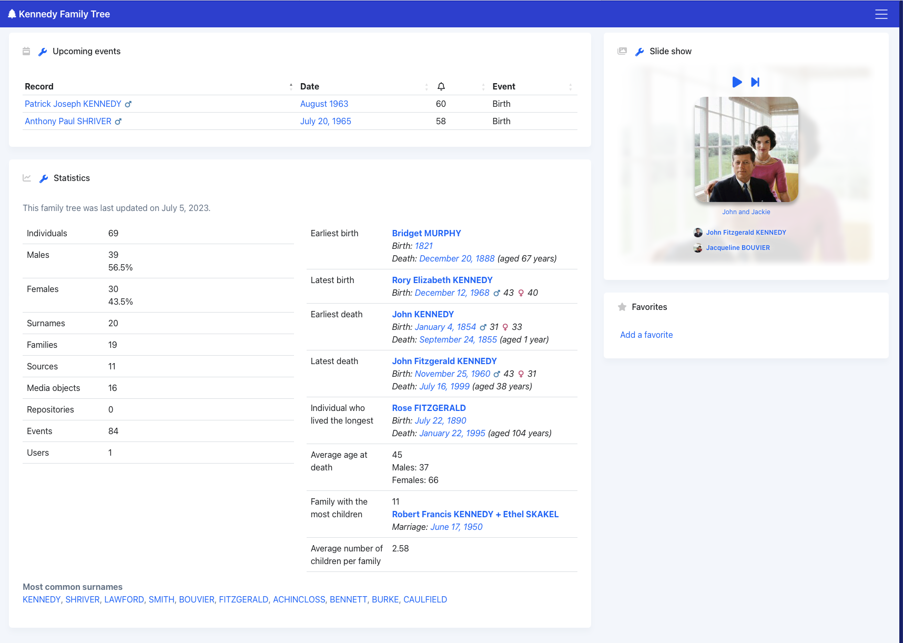
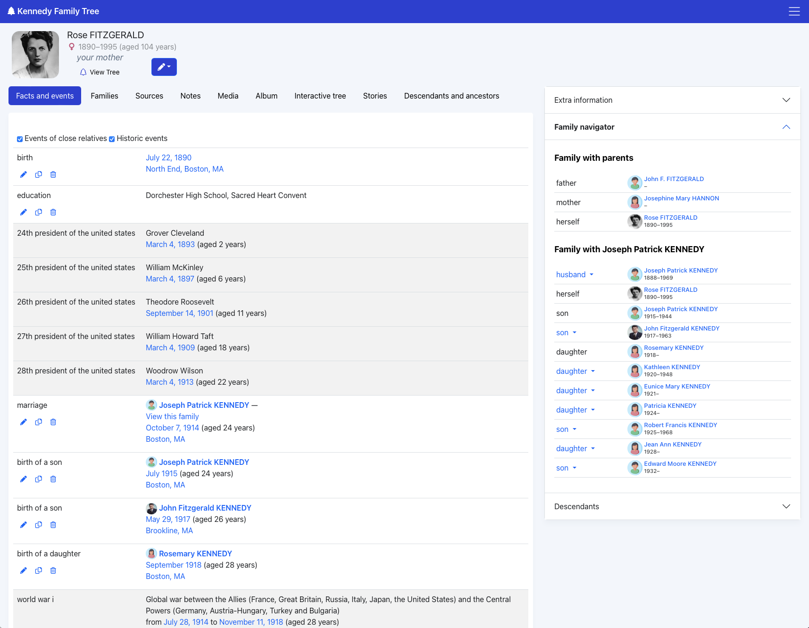
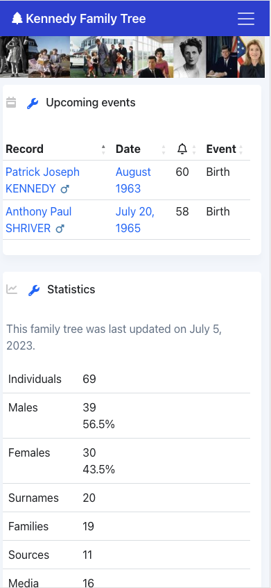
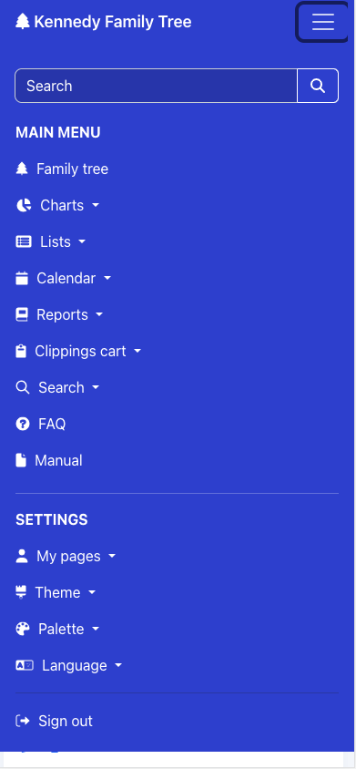
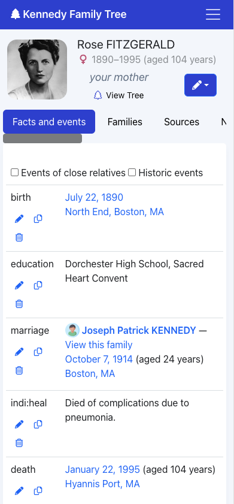

# Modern
This theme optimizes webtrees for ease of use, whether viewing from a desktop or mobile device, while trying to bring a look and feel more like today's popular pay-as-you-go family tree services.

Compatibility: Webtrees 2.1.16

## Features

* Modernizes webtrees default look and feel
* Desktop & Mobile optimized
* Enhanced slideshow block
    * People thumbnails
    * Subtle backrgound
* Enhanced individual page
    * People thumbnails
    * Relationship (ex. "your wife")
    * Compact header
    * Scrollable section headings (must use moder-default palette)
* Tons of theme palettes to choose from:
    * Light mode palettes
    * Dark mode palettes
    * Colorful palettes
    * Playful and serious palettes
    * Palettes that mimick the look and feel of pay as you go services (ex. Ancestry)

<h2>Desktop</h2>

<h2>Mobile</h2>
<table>
<tr>
<td>
</td>
<td>
</td>
<td>
</td>
</tr>
</table>

## Installation
* Download and unzip the release package.
* Place the webtrees-theme-modern folder inside modules_v4 folder of your webtrees installation.

## Upgrading
To upgrade an existing installation of the theme, simply replace the webtrees-theme-modern folder inside the modules_v4 folder with the new one.

## Configuration

Set Modern as your site's default theme:
* Open the control panel, website preferences, choose "Modern" as the default theme

Set the default palette
* Open the control panel and go to the theme section
* Set the default color palette, specify whether the user can choose their own palette, and save.

Change your palette
* Go to your sites front page
* Click on the "Themes" dropdown and choose the Modern theme
* Click on the "Palette" dropdown and choose your desired palette

## Customization

You can change additional settings like displaying icons:
* Open the control panel and go to the theme section
* Change your desired settings and save.