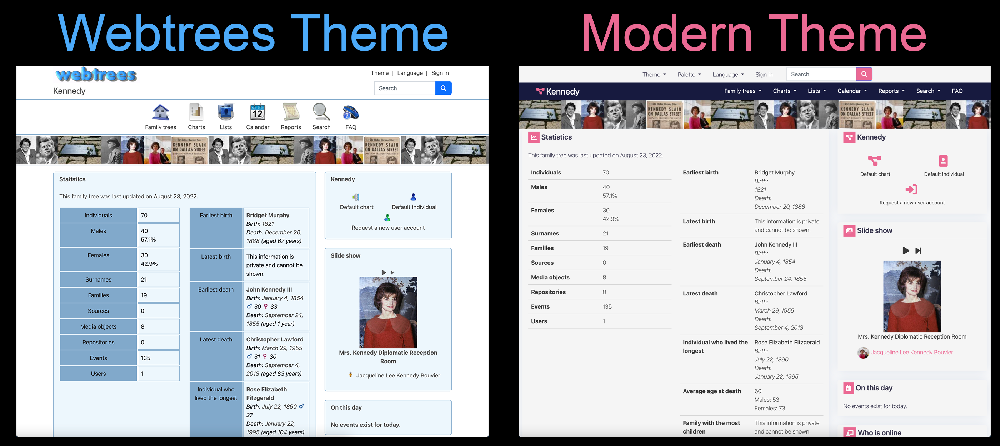
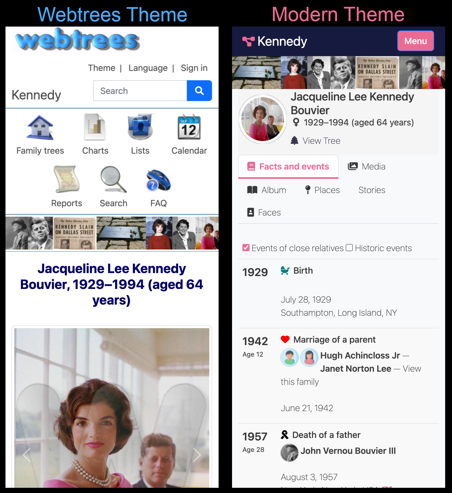
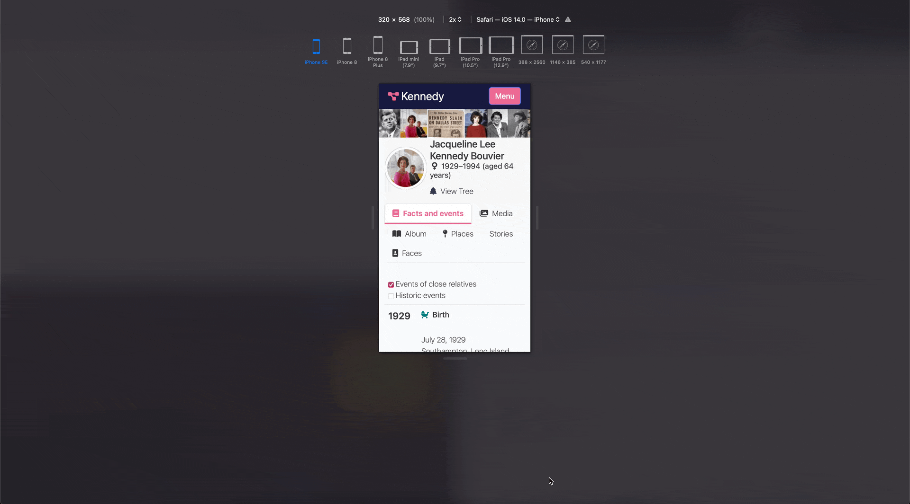
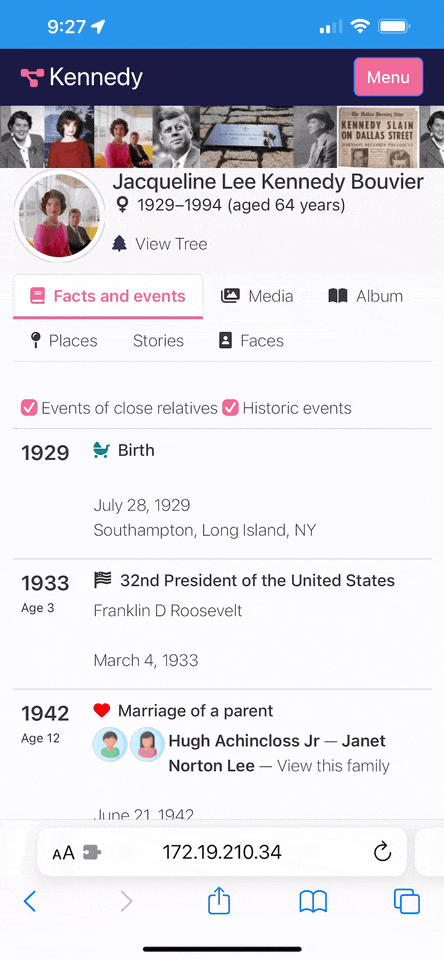
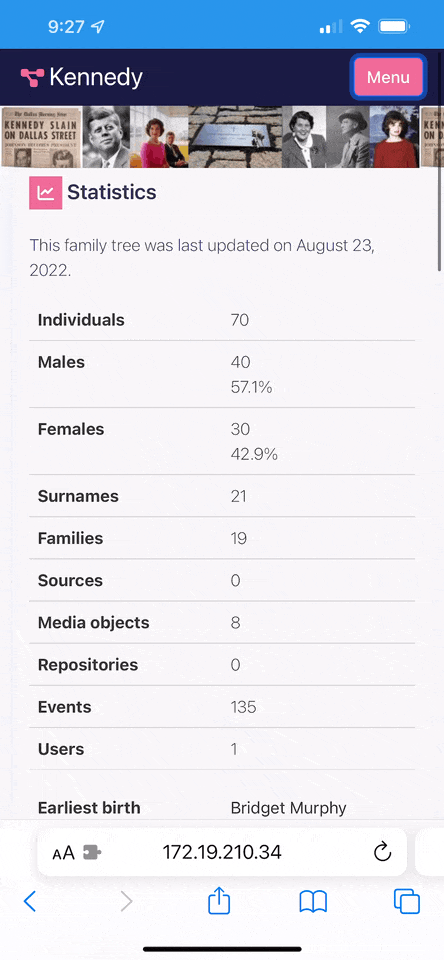

# Modern
This theme optimizes webtrees for ease of use, whether viewing from a desktop or mobile device, while trying to bring a look and feel more like today's popular pay-as-you-go family tree services.

Compatibility: Webtrees 2.1.7

|                                                                       |                                                                    |
| --------------------------------------------------------------------- | ------------------------------------------------------------------ |
| Desktop Comparison  | Mobile Comparison  |

Good for small, medium, and large screen devices
 

|                                                  |                                       |
| ------------------------------------------------ | ------------------------------------- |
| Optimized Layout | Collapsing Menu |

## Problems this theme addresses
While webtrees is fantastic (and I've tried almost all the other family tree options out there), I feel it has some challenges I wanted to solve with this theme:
* Overwhelming - webtrees throws a lot of data and choices at you at once while the popular family tree services go for a simplier user experience.
* Difficult to use on a mobile device - while webtrees does move some data around when viewing from a small screen, everything is still overszied (ex. individual's name, gender, and photo together can take up 100% of the screen, header/menu taking up 50% of the screen, scrunched/overflowing text in tables, large padding / wasted space)
* Antiquated look - webtrees has an overall date look and feel (ex. bubbled, graident, drop shaddowed logo; jagged/out of focus silhouettes; plain fonts; bordered, tabled, text driven experience)
* Boring - webtrees displays a lot of text, which means a lot of reading and zoning out. things like icons, people pictures, colors, etc are needed to break up the monotony.
* Personal pet peeves - ex. family navigator labels are not properly capitalized like labels used in other sections, places take up 2 lines and display coordinates, etc

## Some things you should know
* I hacked this theme together without any true knowledge of how to make webtrees themes, modules, CSS, or even PHP. It may be ugly, it may not work for you, but it works for me.
* I made and will likely continue to enhance this theme for my own personal use. Feel free to report issues and or feature requests but I probably won't address them (but maybe another community or github user will). 
* This theme was designed with webtrees 2.1.7 - using any other version may lead to issues.

## Installation
* Download and unzip the release package.
* Place the webtrees-theme-modern folder inside modules_v4 folder of your webtrees installation.

## Upgrading
To upgrade an existing installation of the theme, simply replace the webtrees-theme-modern folder inside the modules_v4 folder with the new one.

## Configuration

Set Modern as your site's default theme:
* Open the control panel, website preferences, choose "Modern" as the default theme

Set the default palette
* Open the control panel and go to the theme section
* Set the default color palette and specify whether the user can choose their own palette.

Change your palette
* Go to your sites front page
* Click on the "Themes" dropdown and choose the Modern theme
* Click on the "Palette" dropdown and choose your desired palette

## Customization

Change the site's logo:
* edit modules_v4/webtrees-theme-modern/resources/css/custom.css 
* set "content" for the ".wt-site-logo:before" element to your desired Font Awesome 5 unicode value
* save the css to a minimized css: modules_v4/webtrees-theme-modern/resources/css/custom-min.css 

Override CSS styles:
* edit modules_v4/webtrees-theme-modern/resources/css/custom.css 
* add any desired CSS value
* save the css to a minimized css: modules_v4/webtrees-theme-modern/resources/css/custom-min.css 

## Credits and Thanks
This theme was built with knowledge and pieces from the [Argon theme](https://github.com/jchue/argon-webtrees-theme) and [JustLight theme](https://justcarmen.nl/modules-webtrees-2/theme-justlight/). - along with various code and techniques reused from around the net.

Thank you to all the webtrees / theme developers and the webtrees community.

### Sample trees used in screenshots
* gedcom: https://chronoplexsoftware.com/myfamilytree/samples/index.htm
* images: downloaded from various sites

## Dev Tools

* VS Code with extensions
  * #region folding for VS Code
  * colorize
  * MinifyAll